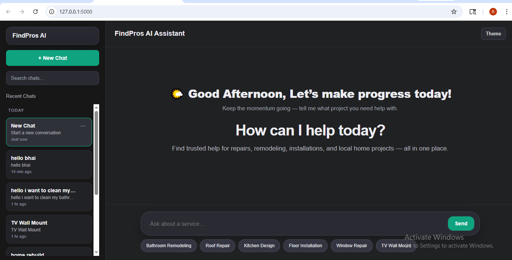
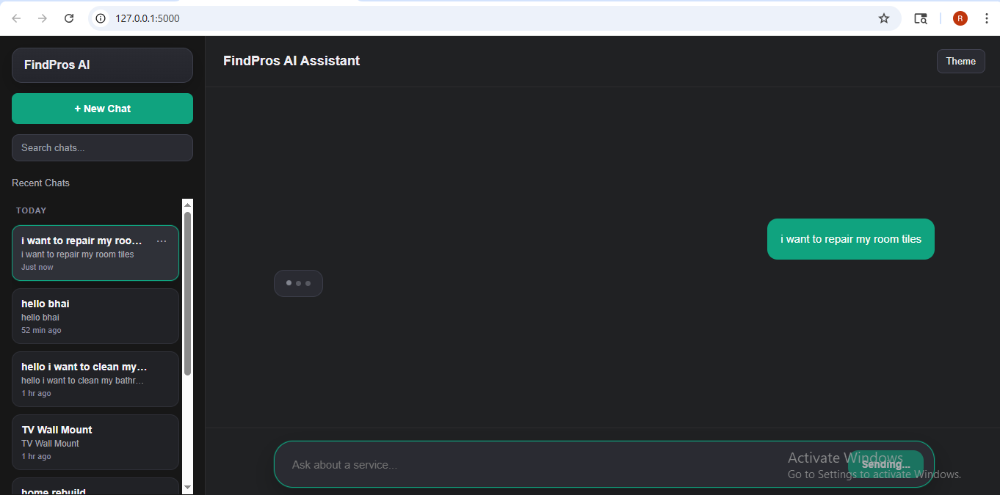
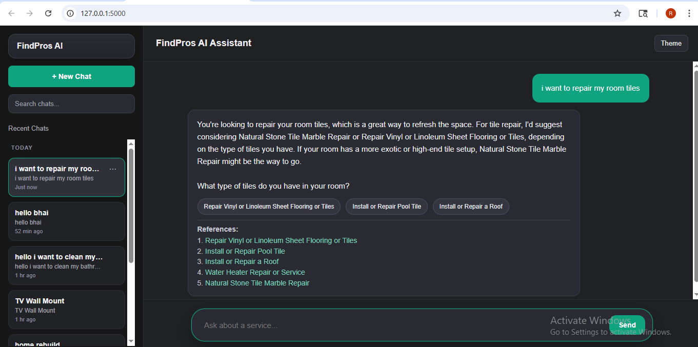

# FindPros AI Assistant

FindPros AI Assistant is an AI-powered smart search and lead-generation assistant built for service marketplace websites. It helps users quickly find the right home improvement, repair, construction, remodeling, and maintenance services through natural language chat.

Users can type queries like:

- I want roof repair
- Need bathroom remodel
- TV wall mount karwana hai
- Window repair needed

The system understands intent and returns the best matching service page.

---

# Features

- AI Smart Search
- Natural Language Queries
- Hindi + English Support
- Fast FAISS Matching
- Smart Redirect Links
- ChatGPT Style UI
- Query Logs

---

# Tech Stack

## Frontend
- HTML
- CSS
- JavaScript

## Backend
- Python
- Flask

## AI / Search
- Llama 3.3 70B Versatile
- Sentence Transformers
- all-MiniLM-L6-v2
- FAISS

---

# Project Structure

```text
findpAssitant/
│── app.py
│── aichat.py
│── fetch.py
│── index.py
│── documents.json
│── metadata.json
│── task_index.faiss
│── query_logs.json
│── README.md
│── img/
│   ├── home.png
│   ├── chat.png
│   └── result.png
│── templates/
│   └── index.html


## snapshots

```md



